# Export dokumentácie

ArchGen exportuje na dvoch úrovniach:

1. **Toolbar aktívneho dokumentu** (`.md`, `.html / Word`) — jeden dokument, jeden súbor.
2. **Export site…** v lište projektu — celý projekt ako priečinok pripravený na
   publikovanie (DocFX / Microsoft Learn, MkDocs, Azure DevOps wiki, GitHub).

Všetky tri sú čisto lokálne: nič sa nikam neposiela, PlantUML sa prípadne renderuje
súkromným lokálnym rendererom (žiadny verejný server), diagramy prechádzajú tou istou
sanitizáciou SVG ako náhľad v editore.

## Markdown export (`.md`)

Jeden dokument ako Markdown s YAML front matter:

```markdown
---
title: "Billing"
project: "Moja architektúra"
template: "arc42"
language: "sk"
date: 2026-09-24
---

# Billing

## Context
...

**Diagram:** sequence

```plantuml
@startuml
...
@enduml
```


```

Diagramy (PlantUML aj Mermaid) zostávajú ako zdrojový kód vo fenced bloku — nič sa
nerenderuje. Názov súboru vzniká z názvu dokumentu (ASCII, malé písmená, bez
diakritiky, najviac 60 znakov; prázdny názov padne na `document.md`).

## HTML export (`.html / Word`)

Samostatná HTML stránka pre tlač do PDF alebo otvorenie vo Worde. PlantUML diagramy
sa vyrenderujú lokálnym rendererom (`render_local_diagram`, žiadny upload), výsledné
SVG sa sanitizuje (`src/lib/local-svg.ts`) a vloží ako `data:image/svg+xml` obrázok.
Mermaid diagramy sa vykreslia lokálne v aplikácii (`src/lib/mermaid.ts`,
[DIAGRAMY.md](DIAGRAMY.md)) a vložia rovnako. Diagramy, ktoré sa lokálne vyrenderovať
nedajú (chyba syntaxe, odmietnutá direktíva, chýbajúci renderer), zostávajú v stránke ako
zdrojový kód; stavový riadok povie, koľko ich bolo.

## Export site… — celý projekt ako web dokumentácie

Tlačidlo **Export site…** v lište projektu (vedľa **Save as…**) vyberie **prázdny
alebo neexistujúci priečinok** a zapíše doň všetky dokumenty projektu naraz:

```text
web-dokumentacia/
  index.md                          názov projektu, dátum, tabuľka dokumentov
  billing.md                        dokument "Billing" (front matter + obsah)
  ops.md                            dokument "Ops"
  images/
    billing/
      context-1.svg                 vyrenderovaný PlantUML diagram
  toc.yml                           DocFX / Microsoft Learn TOC
  mkdocs.yml                        minimálna MkDocs konfigurácia (site_name, nav)
```

- **Exportuje sa aktuálny stav v pamäti**, vrátane neuloženého rozpracovania — stavový
  riadok to povie (`unsaved edits included`), ak sa nezhoduje s naposledy uloženou verziou.
- **Diagramy:** PlantUML sa renderuje rovnakým súkromným lokálnym rendererom ako
  HTML export, Mermaid lokálne v aplikácii, a každý sa zapíše ako samostatný `.svg` súbor
  (`images/<slug dokumentu>/<slug sekcie>-<poradie>.svg`), na ktorý stránka dokumentu
  odkazuje relatívnym odkazom ``. Diagram, ktorý sa lokálne
  vyrenderovať nedá (chyba renderera alebo syntaxe, odmietnutá Mermaid direktíva),
  zostane vo fenced bloku (napr. ```` ```mermaid ````)
  — presne to na GitHube, Azure DevOps wiki aj v MkDocs Material vykreslí natívne bez
  akéhokoľvek servera. Stavový riadok po exporte ukáže, koľko diagramov skončilo ako
  SVG a koľko ako zdroj.
- **Názvy súborov** sú prenosné (ASCII, malé písmená, bez diakritiky) a jedinečné —
  kolízia dostane `-2`, `-3`; dokument sa nikdy nevolá `index` (to meno patrí
  `index.md`). Rezervované mená Windows (`CON`, `PRN`, `COM1`…) sa tiež obchádzajú.
- **Nikdy sa neprepíše ani nezlúči do existujúceho obsahu.** Cieľový priečinok musí byť
  nový alebo prázdny; inak export skončí chybou v stavovom riadku a nezapíše nič.

### Publikovanie

- **DocFX / Microsoft Learn:** priečinok je hotový zdroj obsahu (`content`) v
  `docfx.json`; `toc.yml` už je v DocFX formáte (`name` / `href`, `index.md` prvý).
- **MkDocs:** `mkdocs serve` alebo `mkdocs build` priamo v exportovanom priečinku —
  `mkdocs.yml` už obsahuje `site_name` a `nav`. Pre farebnejšiu tému stačí do
  `mkdocs.yml` doplniť `theme: { name: material }` (vyžaduje `mkdocs-material`).
- **Azure DevOps wiki:** priečinok pushni do repozitára a v **Repos → Wiki → Publish
  code as Wiki** ukáž na túto vetvu/priečinok. `toc.yml` ADO wiki nepoužíva — poradie
  strán v sidebar rieši vlastný `.order` súbor (voliteľné, dá sa doplniť ručne); bez
  neho sa stránky zoradia abecedne podľa názvu súboru.
- **GitHub:** priečinok pushni do repozitára (alebo do `docs/` existujúceho repa).
  Markdown aj fenced ```` ```mermaid ```` bloky sa vykreslia priamo v prehliadači
  súborov. YAML front matter GitHub bez GitHub Pages/Jekyll nestrháva — v bežnom repe
  je na začiatku stránky vidno ako text; cez GitHub Pages (Jekyll) sa spracuje ako
  front matter a nezobrazí sa.

## Bezpečnosť exportu (Rust, `src-tauri/src/site.rs`)

Zoznam súborov zostavuje čisto frontend (`src/lib/site-export.ts`); Rust príkaz
`export_site` mu never nedôveruje a pred zápisom overí:

- cieľový priečinok neexistuje alebo je prázdny (inak chyba, nič sa nezapíše),
- každá relatívna cesta je `/`-oddelená, bez `..`, bez absolútnej cesty, každá zložka
  prejde rovnakou kontrolou ako mená v manifeste projektu (`project::safe_name`),
- hĺbka cesty najviac 4 zložky, prípona iba `.md`, `.yml` alebo `.svg`,
- najviac 2000 súborov a 64 MiB spolu,
- dve cesty, ktoré sa líšia iba veľkosťou písmen (`A.md` vs `a.md`), sa považujú za
  kolíziu (Windows aj macOS ich rozlišujú, ale súborový systém je case-insensitive).

Pri akejkoľvek z týchto chýb sa nezapíše vôbec nič; zápis samotný je atomický
(`project::write_atomic`) rovnako ako ukladanie projektu.
